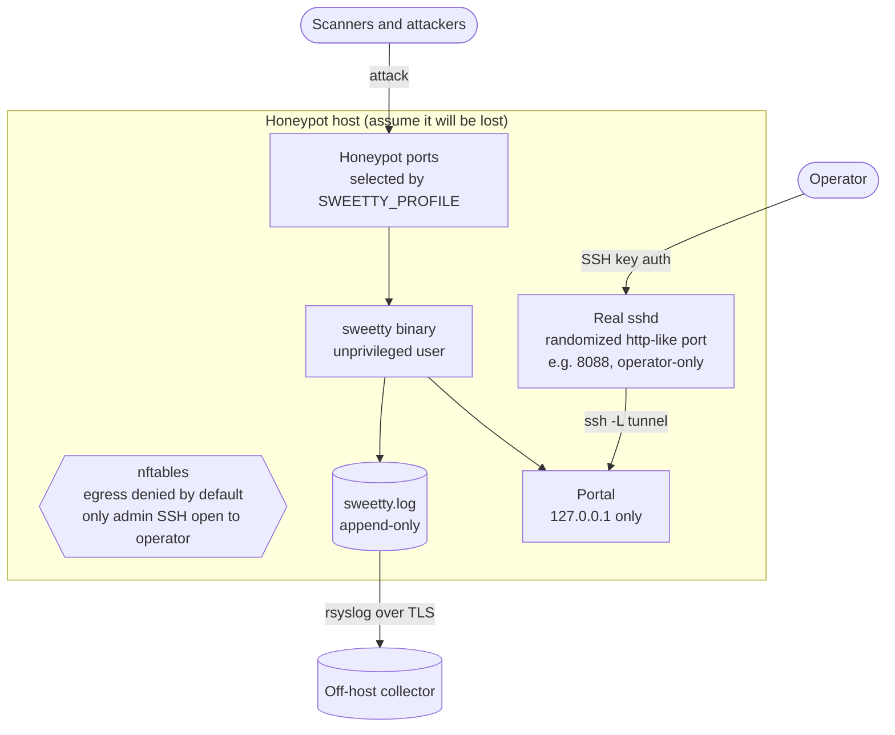
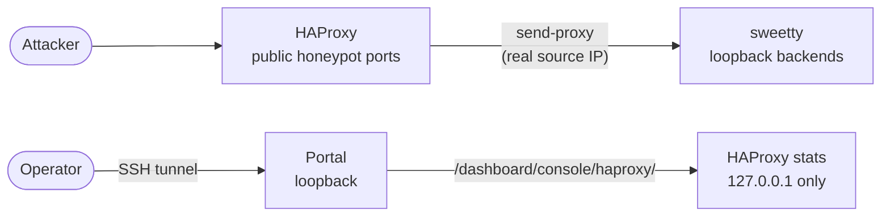
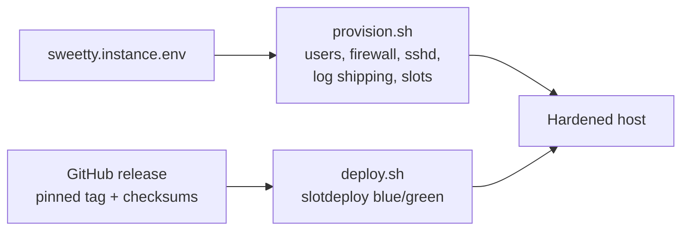

# Instance Architecture

How one SweeTTY honeypot sits on a host: what is exposed, what is locked down, and how the operator reaches it. See [`README.md`](./README.md) for the operating flows.

## The honeypot host

The honeypot ports face the world. The management plane has no public footprint: the portal binds loopback, the operator reaches it by tunnelling the real SSH, and the box only ever talks outbound to ship its log.

The operator never opens a management port. They `ssh -L <local>:127.0.0.1:<portal_port> operator@host -p <admin_ssh_port>` and open the portal at `localhost`. The admin SSH port is randomized per instance from a pool of http-like ports so it blends in as a web service, and it is the only port the firewall opens to the operator.

## HAProxy edge (the default)

HAProxy is the default edge (`TOPOLOGY=haproxy`; set `direct` to have sweetty bind the public ports itself). It fronts only the profile-selected honeypot ports, to preserve the real attacker source IP (PROXY protocol), shed obvious floods with gentle per-source limits (turned into `FLOOD_BLOCKED` events by `sweetty-hapwatch`), and route blue/green deploys. It does not front the portal, which stays loopback and SSH-tunnel-only. Its stats console is reached through the portal over that same tunnel. It is started after sshd has moved off port 22, so its bind on :22 succeeds.

## Deploy and lifecycle

Provisioning hardens the host and lays out the slots; deploys are pinned, checksum-verified, and blue/green. No binary runs until an explicit tag is deployed.

