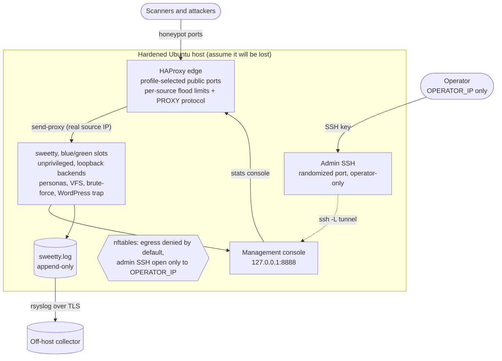

# sweetty-instance-template

The deployment and provisioning side of [SweeTTY](https://github.com/adrianmcphee/sweetty),
the multi-protocol honeypot. The product repo builds and ships the binary; this
repo turns a fresh Ubuntu host into a hardened honeypot running a pinned release.

The two are kept separate on purpose, so the honeypot and the way it is operated
can evolve independently. Nothing in here belongs in the product, and nothing in
the product hard-codes how it gets deployed.

In short:

- **The product** ([sweetty](https://github.com/adrianmcphee/sweetty)) builds the
  honeypot binary and publishes it as a pinned release (`vX.Y.Z`).
- **This repo** provisions a fresh Ubuntu host and deploys that pinned release into
  a blue/green slot behind a hardened edge.

This repo has two phases of use: you **provision a host once** from these files,
then **deploy releases into it** as often as you like. Your per-box secrets (the
operator address, the admin SSH port, the deploy keys) live in a gitignored
`sweetty.instance.env` that never enters version control, so nothing box-specific
belongs in the repo and you work from a plain clone. Provisioning copies these files
onto the host, without their git history, and that on-host copy is where you run
deploys and updates with `make deploy TAG=vX.Y.Z`. You never build or run the
honeypot from your laptop; the host pulls a published release tag, verifies its
checksum, and rolls it into the inactive slot. Initial setup and the deploy/rollback
commands are below.

## Architecture at a glance

The honeypot ports face the world behind an HAProxy edge; the management plane has
no public footprint. The operator reaches the console only by tunnelling the real
SSH (on a randomized, operator-only port), and the box's sole outbound traffic is
shipping its log. [`ARCHITECTURE.md`](./ARCHITECTURE.md) breaks down each piece.



## Set up a box from scratch

Clone this repo and work from it directly. Your operator address, admin port, and
keys go in a gitignored `sweetty.instance.env` and are never committed, so a plain
clone is all you need; there is nothing box-specific to fork. Fork it only if you
plan to version-control your own changes to the provisioning itself (custom firewall
rules, extra personas, a different log collector). Automating this with an agent?
The exact, deterministic procedure is in [`AGENTS.md`](./AGENTS.md); the human
walkthrough is below.

### Before you start, you need three things

- A **fresh Ubuntu host** (24.04 or 26.04 LTS, **x86_64**) on its own segment,
  that exists only to be attacked. Nothing real should live near it.
- The **public IP you connect from** (your laptop's egress address, e.g. what
  `curl ifconfig.me` shows). This becomes `OPERATOR_IP`, the only address allowed
  to reach management. It is the address you connect **from**, never the server's
  own IP. A wrong value locks you out and the box has to be rebuilt.
- A **deploy SSH key**. The simplest choice is your everyday key: install its
  public key as the deploy key and `ssh -p PORT deploy@HOST` then works with
  nothing extra. Whatever it is named (`id_ed25519.pub`, `id_rsa.pub`,
  `id_ecdsa.pub`, ...), `ls ~/.ssh/*.pub` shows your public keys; pick the one
  whose private key you actually use. If you use a separate, dedicated key instead,
  every login and tunnel command below needs
  `-i <that private key>` (or an ssh-config `IdentityFile`), because the box
  authorizes only the one public key you install and password auth is off, so your
  other keys are refused. You keep the private key; only the public key goes on the
  box, for the `deploy` user, the sole login provisioning creates.

Then pick one path. Both end at the same hardened, running honeypot.

### Path A: cloud-init (hands-off, best for a brand-new VM)

The box provisions and deploys itself on first boot. You paste one file when you
create the VM and never SSH in to set it up.

1. Copy `sweetty.instance.env.example` to `sweetty.instance.env` and fill in
   `OPERATOR_IP` and `RELEASE_TAG` (a published
   [sweetty release](https://github.com/adrianmcphee/sweetty/releases), e.g.
   `v0.3.26`). Leave `SWEETTY_PROFILE="random"` for a per-instance service
   surface, leave `TOPOLOGY="haproxy"`, and leave `ADMIN_SSH_PORT` **empty** so
   real SSH lands on a per-instance random port (no fleet-wide tell). The chosen
   profile, chosen port, and exact login + tunnel commands are written back during
   provisioning.
2. Edit `cloud-init/user-data.yaml`: copy those env values into its
   `sweetty.instance.env` block, paste your deploy **public** key into the
   `deploy.pub` block, and leave `PROVISION_REF` at the default release tag (or pin
   your own reviewed tag). Set `PROVISION_SHA` to that tag's commit
   (`git rev-parse v0.2.0^{commit}`). Pin a tag rather than a moving branch: a tag
   names one reviewed commit and never moves, whereas a branch tip drifts under the
   pin and would power a re-provisioned box off until you re-review and bump the SHA.
3. Create the VM and paste that `user-data.yaml` into the provider's **Cloud-Init /
   User-Data** field. **That field is easy to leave blank, and if you do, nothing
   provisions**: the box comes up as plain Ubuntu. Wait ~3-5 minutes.
4. **Reboot and verify** (below).

### Path B: over SSH (for a host you already have root on)

One script over root SSH does everything. This is what `AGENTS.md` automates.

1. Fill `sweetty.instance.env` as in Path A step 1 (no `PROVISION_SHA` needed).
2. Copy the repo, your env, and your deploy **public** key onto the host:

   ```bash
   rsync -a --exclude='.git' ./ root@HOST:/root/sweetty-instance-template/
   scp sweetty.instance.env root@HOST:/root/sweetty-instance-template/
   scp deploy.pub          root@HOST:/root/deploy.pub
   ```

3. Run the bootstrap as root. It provisions, installs the deploy key, deploys the
   pinned release, and verifies the honeypot is actually serving before it returns:

   ```bash
   ssh root@HOST 'cd /root/sweetty-instance-template && \
     INSTANCE_ENV=$PWD/sweetty.instance.env DEPLOY_PUBKEY=/root/deploy.pub ./bootstrap.sh'
   ```

   Provisioning moves SSH off port 22 and disables root login partway through; your
   running root session survives. `bootstrap.sh` ends by printing the randomized
   admin port and the exact login + tunnel commands (also saved to
   `/root/sweetty-access.txt`); from now on you log in as `deploy` (below).
4. **Reboot and verify** (below).

### Reboot and verify (do this every time)

A honeypot must survive reboots unattended, and a reboot is the cheapest proof
provisioning is sound:

```bash
ssh -p ADMIN_SSH_PORT deploy@HOST 'sudo systemctl reboot'
sleep 60
ssh -p ADMIN_SSH_PORT deploy@HOST \
  'cd sweetty-instance-template && \
   set -a; . ./sweetty.instance.env; set +a; \
   systemctl is-active "sweetty-$(cat /opt/sweetty/.active-slot)".service nftables haproxy; \
   for p in $(provision/render-surface.sh backend-ports); do ss -tln | grep -q ":$p " && echo "$p ok" || echo "$p MISSING"; done'
```

Expect the honeypot slot active, `nftables` active, and every honeypot backend
serving. The loop checks the loopback backends SweeTTY actually listens on, not
the public edge ports (HAProxy binds those even when the backend behind them is
dead), so a service the pinned release cannot run shows up here as `MISSING`.
If a reboot does not come back cleanly, that is a provisioning defect, not a
one-off (the egress firewall must allow the link-local range so cloud-init can
reach the instance metadata service on boot).

### Reach it afterward

- **Admin shell:** `ssh -p ADMIN_SSH_PORT deploy@HOST`, where `ADMIN_SSH_PORT` is
  the randomized port from `/root/sweetty-access.txt` (or the bootstrap output).
  Root login and password auth are off by design; the only door is the `deploy`
  user with your key, firewalled to `OPERATOR_IP`. Port 22 is the honeypot, not
  real SSH.
- **The management console** binds loopback `8888` and is never exposed. Forward it
  over the admin SSH, and use `-fN` so it is a tunnel, not a login shell:

  ```bash
  ssh -fN -L 8888:127.0.0.1:8888 deploy@HOST -p ADMIN_SSH_PORT
  # then open http://localhost:8888   (stop it later: pkill -f '8888:127.0.0.1:8888')
  ```

- **Update to a new release:** SSH to the box and run the deploy from the on-host
  copy of this repo. It pulls the tag, verifies its checksum, installs it into the
  inactive slot, health-checks it, and flips with a sub-second cutover:

  ```bash
  ssh -p ADMIN_SSH_PORT deploy@HOST
  cd sweetty-instance-template && make deploy TAG=vX.Y.Z
  ```

- **Roll back** to the previous slot (its binary is still on disk, so this is an
  instant switch, not a rebuild), and **check** which slot and release is live:

  ```bash
  cd sweetty-instance-template && make rollback
  cd sweetty-instance-template && make status
  ```

Running several honeypots? Keep one `sweetty.instance.env` per box (they are
gitignored, so they never collide) and deploy to each from the same clone. You need
a separate repo or branch only when a box also needs its own provisioning changes
tracked.

## What you get

- A fresh-host provisioning flow: cloud-init plus an idempotent `provision.sh`
  (and an optional Terraform example) that create the unprivileged `sweetty`
  user, lay out `/opt/sweetty`, install the systemd slot units, and harden the
  box.
- A profile-aware service surface renderer. One `SWEETTY_PROFILE` value drives
  SweeTTY listeners, HAProxy frontends/backends, nftables ports, and verification.
  Each rendered listener also records its public port, so the management console
  shows the real port an attacker reaches rather than the loopback backend behind
  the edge.
- An nftables firewall that opens the attack surface to the world, restricts
  management to one operator address, and denies the honeypot any egress.
- Intrusion-detection tripwires (auditd, optional osquery) tuned to alarm only on
  events the honeypot is contractually unable to produce.
- Off-host, append-only log shipping.
- A HAProxy edge (the default topology) for real-source-IP preservation and gentle flood limiting.
- A pinned, checksum-verified blue/green deploy built on
  [slotdeploy](https://github.com/adrianmcphee/slotdeploy).

## Threat model: assume-escape

The whole design follows from one premise. A honeypot is an attractant you
deliberately expose to attack, so plan for the worst case and make it boring.

SweeTTY itself never executes attacker input. Commands are emulated in-process,
downloads are theatre (the URL is logged, never fetched), and files an attacker
"creates" live in an in-memory overlay that evaporates on disconnect. That is the
product's safety boundary, and it is strong.

This repo does not rely on it. The host treats the `sweetty` user as **already
hostile**, and every control here is built for the world where the deception
boundary has somehow been crossed:

- The service runs as an unprivileged user with no shell, under systemd
  hardening that makes the filesystem read-only except its log directory,
  hides the real `/proc`, strips capabilities to the single one it needs to bind
  low ports, and filters its system calls.
- The firewall denies the `sweetty` user all outbound traffic and logs any
  attempt, because a honeypot that calls out is either compromised or being used
  as a relay against someone else.
- The tripwires alarm on the three things the honeypot can never legitimately do:
  spawn a child, open an outbound connection, or write outside its log. There is
  no benign version of these events on this host, so the alarms are near
  zero false positive.
- The log is shipped off-host continuously and kept append-only on disk, so the
  intelligence survives even if the box does not.

In short: the product is trustworthy, and the host is built as though it is not.

## Layout

```
sweetty-instance-template/
├── sweetty.instance.env.example   Single source of truth for one host (copy, fill, gitignored)
├── Makefile                       Local gates plus provision/deploy/rollback/status wrappers
├── cloud-init/
│   └── user-data.yaml             First-boot provisioning
├── provision/
│   ├── provision.sh               Idempotent host bootstrap
│   ├── render-surface.sh          Renders profile-selected config and HAProxy
│   ├── render-nftables.sh         Renders the firewall from the instance env
│   ├── nftables/sweetty.nft.template
│   ├── systemd/                   sweetty-blue.service, sweetty-green.service
│   ├── sudoers/                   Narrow deploy-user grants
│   └── sysctl/                    Kernel and network hardening
├── ids/
│   ├── auditd/sweetty.rules       Primary kernel tripwires
│   ├── osquery/                   Optional pack and config
│   └── README.md                  Why these are zero-false-positive alarms
├── logging/
│   ├── rsyslog/60-sweetty.conf    Off-host shipping (default)
│   ├── vector.toml                Off-host shipping (JSON-native alternative)
│   └── README.md                  Append-only rotation caveat
├── haproxy/
│   └── README.md                  PROXY protocol, gentle limits, the decision
├── deploy/
│   ├── deploy.sh                  Pinned, verified, blue/green deploy
│   ├── slotdeploy.yaml            slotdeploy commands runtime
│   └── README.md
└── terraform/                     Optional single-host example
```

## Provisioning flow

1. Create an isolated Ubuntu host, on its own segment, that exists only to be
   attacked. Nothing real should live near it.
2. Copy `sweetty.instance.env.example` to `sweetty.instance.env` and fill it in:
   the operator address, the admin SSH port, the release tag to run, the service
   profile, the DNS resolvers, and the log endpoint. This file is the single
   source of truth and is gitignored. Set `OPERATOR_IP` to the address you
   actually connect from:
   admin SSH is firewalled to it alone, so a wrong value locks you out and the box
   has to be rebuilt. The renderer refuses an all-internet wildcard, so you cannot
   accidentally open management to the world.
3. Run provisioning. cloud-init does this at first boot; to run it by hand:

   ```bash
   sudo INSTANCE_ENV=sweetty.instance.env provision/provision.sh
   ```

   It creates the `sweetty` and `deploy` users, lays out `/opt/sweetty`, installs
   the two slot units, moves real SSH off port 22 (so the honeypot can bind 22),
   loads the nftables firewall and sysctl hardening, installs the auditd
   tripwires and optional osquery pack, wires up off-host log shipping, and makes
   `sweetty.log` append-only. It is idempotent; run it again any time.

   When cloud-init runs it at first boot, it first fetches this provisioning code
   and verifies it against a pinned commit before running any of it as root, since
   the whole perimeter comes from here. `PROVISION_REF` defaults to an immutable
   release tag: a tag names one reviewed commit and never moves, so the pin holds,
   whereas a moving branch would drift its tip under the pin. Set `PROVISION_SHA` to
   that tag's commit (`git rev-parse <tag>^{commit}`); on a mismatch the box powers
   itself off instead of provisioning from an unknown tree.
4. Add the deploy public key to the `deploy` user, then deploy a release. The
   host has no binary until you do, on purpose.

`SWEETTY_PROFILE` selects the public deception surface. `random` is recommended
for a fleet: provisioning resolves it once and appends the concrete profile to
the instance env, so one box stays stable while different boxes do not all look
the same. `infra` exposes MySQL, Docker, and Redis, `legacy` exposes ADB, and `full`
exposes every service only when you deliberately want a test or demo sensor.

A profile only serves what the pinned `RELEASE_TAG` binary implements. mysql,
docker, redis, and adb landed after `v0.3.20`; pinning an older release with a
profile that names them (`infra`, `legacy`, `full`, or a `random` that resolves to
`infra`/`legacy`) stands those ports up behind the edge with a dead backend that
accepts connections, serves nothing, and logs nothing. Pin a release that
implements every service your profile lists. The reboot-verify probes the loopback
backends, so a mismatch surfaces as a `MISSING` backend instead of a silent
open port.

Changing the exposed surface after provisioning is deliberately not a
`make deploy` operation. `config.json` is rendered once, at provision time, and
owned by root; a deploy only swaps the binary and leaves the config untouched. To
change `SWEETTY_PROFILE` (or to pick up a service a newer `RELEASE_TAG` adds) on a
running box, remove `/opt/sweetty/config.json` and re-run provisioning as root
(provisioning will not overwrite a config that already exists). On a hardened box
root login is off, so in practice that means the provider serial console or a
rebuild. A consequence: a box provisioned before the config carried public ports
keeps showing the loopback backend ports in the console until it is re-provisioned;
a freshly provisioned box shows the real public ports.

Real SSH is on a randomized, http-like `ADMIN_SSH_PORT` (8088 and friends, picked
per instance so it blends in as a web service with no fixed admin-port tell) and
reachable only from the operator address. Port 22 is the honeypot. If you
provision over an existing port-22 session, reconnect on the admin port once
`provision.sh` restarts sshd.

The management portal is never exposed. It binds loopback, and you reach it by
forwarding the SSH port to it, so SSH key auth is the only front door and the
portal itself needs no login. You log in as the `deploy` user, the only account
with a shell and the only key provisioning installs (root login and password auth
are disabled), so hold its private key:

```
ssh -L 8888:127.0.0.1:8888 deploy@host -p <ADMIN_SSH_PORT>
# then open http://localhost:8888
```

## The HAProxy edge

The default topology (`TOPOLOGY="haproxy"`) puts a transparent HAProxy TCP edge in
front of the honeypot ports. `provision.sh` installs and starts it. It is
invisible to attackers (a plain TCP passthrough, no termination) and does three
jobs: preserves the real attacker source IP, sheds obvious connection floods, and
exposes its stats console inside the management console. Choose `TOPOLOGY="direct"`
to skip it and have sweetty bind the public ports itself.

Two rules are non-negotiable, and `haproxy/README.md` covers both in full:

- **PROXY protocol to the backend.** sweetty must keep logging the real attacker
  IP, so HAProxy sends the PROXY header and sweetty runs with PROXY-protocol
  parsing enabled. `provision/render-surface.sh` renders both sides from the same
  `SWEETTY_PROFILE`, so the two settings stay a matched pair.
- **Gentle rate limiting only.** The stick-table limits shed obvious floods and
  nothing more. Heavy upstream rate limiting is wrong for a honeypot: it throws
  away the very intelligence the honeypot exists to collect, because a scanner that
  gets throttled simply leaves. Volumetric protection belongs in nftables and the
  cloud firewall, at the network layer, not as application throttling.

When the edge sheds a flood, the `sweetty hapwatch` helper (a `sweetty-hapwatch`
systemd unit provisioning installs) reads HAProxy's stick-table over its local
admin socket and logs a `FLOOD_BLOCKED` event, so the rate-limiting shows up in
the same live feed as everything else. The HAProxy stats page is bound to loopback
and reverse-proxied by the portal at `/dashboard/console/haproxy/`, reached over
the same SSH tunnel with no second login.

## Deploy flow

Deploys are pinned and verified. There is no implicit `latest`, anywhere. Run them
on the host as the `deploy` user (it uses the narrow sudo grants provisioning set
up), or from CI holding the deploy key.

```bash
deploy/deploy.sh v0.3.26
```

This pulls `sweetty_<ver>_linux_<arch>.tar.gz` and `checksums.txt` from the
product repo's GitHub Releases for that exact tag, verifies the artifact with
`sha256sum` before installing anything, drops the binary into the inactive slot,
and hands off to slotdeploy to start the new slot, health-check it, stop the old
one, and flip the active marker. Roll back with
`slotdeploy rollback --config deploy/slotdeploy.yaml`; the previous binary is
still on disk, so it is a switch, not a rebuild.

Each deploy is a sub-second stop-start cutover: slotdeploy stops the active slot
and starts the new one, because the two slots share one set of backend ports and a
port can be held by only one process. That trade is deliberate for a honeypot: it
can miss a few connections during a planned deploy, but it must never run two
attack surfaces at once or expose a half-bound instance. This holds in both the
HAProxy (default) and direct topologies as shipped; the HAProxy edge preserves the
real source IP and sheds floods, it does not remove the cutover gap. Full detail in
`deploy/README.md`.

## Conventions

- **No AI attribution in commits.** No `Co-Authored-By`, no "Generated with",
  nothing. The commit-msg hook and CI enforce it.
- **No em dashes**, in any file or any commit message. The hook rejects them.
- **Atomic, semantic commits.** One logical change each.
- **Secrets and captured data never get committed.** Logs, keys, certs, real
  `*.env`, terraform state, and `*.tfvars` (except the examples) are gitignored.

Run `make check` before committing: it checks for em dashes, shellchecks the
scripts, and syntax-checks the firewall ruleset.

## A word of caution

A honeypot ends up on the radar of the people you are studying. Run it on a host
you are prepared to lose, isolated from anything real, with egress constrained,
and make sure you are authorised to operate it on the network where you deploy
it. Everything the attacker sees is fake; the box is still genuinely exposed.
